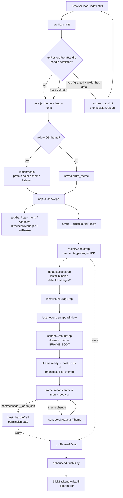
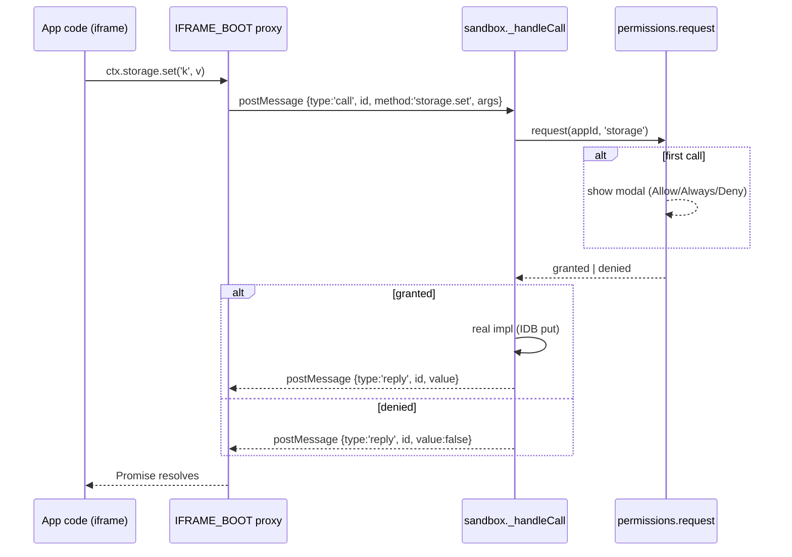

# Architecture — Package System

This is a contributor-facing overview of how apps and commands are wired internally. If you just want to *build* a package, see [packages.md](./packages.md). For the portable profile feature in particular, see [profile.md](./profile.md).

---

## Boot & runtime overview



### Sandbox bridge — single ctx call



---

## Module map

| File | Role |
|---|---|
| [`JavaScript/util.js`](../JavaScript/util.js) | Shared helpers: `window.t()` i18n accessor, `window.escapeHTML`, `window.storage.{get,set,del}` (JSON-aware, SecurityError-safe), `window.mq` with synced `is-mobile`/`is-touch`/`is-reduced-motion` classes on `<html>`, toast/confirm fallbacks |
| [`JavaScript/db.js`](../JavaScript/db.js) | Shared IndexedDB helpers: cached `openDB(name, version, upgrade)`, `closeDB`, `txRun`, `rangeCollect`, `rangeDelete`. Used by both `registry.js` and `sandbox.js` |
| [`JavaScript/storage.js`](../JavaScript/storage.js) | Tiny facade centralising the storage key/DB strings: `Storage.constants` (`PACKAGES_DB`, `APP_DB_PREFIX`, `LS_PREFIX`), `Storage.ls` passthrough to `window.storage`, `Storage.registry.openDB()`, `Storage.appKV.{get,set,remove,dumpAll}`, `Storage.deleteAppKV`. Additive — does not replace `util.js` `window.storage` |
| [`JavaScript/installer.js`](../JavaScript/installer.js) | Reads `.zip` (JSZip lazy-loaded from CDN), validates the manifest, shows install confirmation, sets correct MIME types on extracted Blobs, wires drag-drop overlay |
| [`JavaScript/registry.js`](../JavaScript/registry.js) | IndexedDB `aruta_packages` (manifests + files) via `db.js`, `localStorage.aruta_installed_apps` cache for fast boot, registers custom apps in `WIN_META` + dynamically creates their window DOM + Start menu items |
| [`JavaScript/sandbox.js`](../JavaScript/sandbox.js) | Apps → `<iframe sandbox="allow-scripts allow-modals">` with `srcdoc` bootstrap, commands → blob-URL dynamic `import()`. Implements the `ctx` bridge (postMessage for apps, direct for commands) and the permission-gated method dispatcher. Per-app storage DB handles cached via `db.js` |
| [`JavaScript/permissions.js`](../JavaScript/permissions.js) | Per-app grant store (backed by `window.storage`), runtime prompt modal (serialized so only one shows at a time), Settings → Permissions renderer |
| [`JavaScript/os-windows.js`](../JavaScript/os-windows.js) | Window manager split out of `os.js`: `WIN_META`, taskbar tabs (`addWindowTab`/`removeWindowTab`/`updateActiveTab`), `openWindow`/`closeWindow`/`minimizeWindow`/`focusWindow`/`toggleMaximize`, `initWindowManager`, `initDrag`, `initResize`. Must load before the other `os-*.js` files — `registry.js` and the rest reach into these globals |
| [`JavaScript/os.js`](../JavaScript/os.js) | OS shell: start menu, mobile swipe section switching, clock, tab title, bio typewriter. Coordinator that binds the `os-*.js` siblings together |
| [`JavaScript/os-settings.js`](../JavaScript/os-settings.js) | Settings panel (`initSettings`) — theme/font/accent/clock/language/performance toggles, reset/wipe — and portable-profile UI (`initProfileSettings` — pick folder, reconnect, export/import zip) |
| [`JavaScript/os-sysinfo.js`](../JavaScript/os-sysinfo.js) | System-info popover (`initSysInfo`): IP/location/battery/CPU/browser/engine/FPS/uptime rows auto-refreshed every second while open |
| [`JavaScript/terminal.js`](../JavaScript/terminal.js) | Shell UI, parser (quoted strings), history, built-in commands. Unknown names fall through to `registry.listCommands()` → `sandbox.runCommand()` |
| [`JavaScript/defaults.js`](../JavaScript/defaults.js) | Auto-installs bundled `defaultPackages/*` on first boot. Packages fetched and installed in parallel (one burst, not a serial chain). Respects a blacklist so uninstalls persist. Re-runs when a default's `version` changes |
| [`JavaScript/profile.js`](../JavaScript/profile.js) | Portable profile snapshot/restore. `DiskBackend` mirrors state to a folder via FS Access API (Chromium); `exportZip`/`importZip` work in any browser. Boot-gates registry/defaults via `window.__arutaProfileReady`. See [profile.md](./profile.md) |
| [`JavaScript/zip.js`](../JavaScript/zip.js) | STORE-only zip codec (`encode`/`decode`). Used by `profile.js` and Grimoire's workspace export. No compression — keeps the file purely a transport container |

Script load order in `index.html`:
```
config.js  core.js  util.js  zip.js  db.js  storage.js  profile.js
effects.js  desktop.js  content.js  extras.js
os-windows.js  os.js  os-settings.js  os-sysinfo.js
permissions.js  registry.js  sandbox.js  installer.js  defaults.js  terminal.js  app.js
```

`profile.js` runs an IIFE on load that sets `window.__arutaProfileReady` — a Promise that may resolve to `true` if a linked folder triggered a state restore + reload (in which case `app.js` aborts further bootstrap). See [profile.md](./profile.md).

`app.js:showApp()` calls `registry.bootstrap()` (hydrate from IndexedDB) and `installer.initDragDrop()`.

---

## Storage layout

All the DB and key-prefix string literals live in `storage.js:Storage.constants` (`PACKAGES_DB`, `APP_DB_PREFIX`, `LS_PREFIX`). `registry.js`, `profile.js`, and `sandbox.js` read them from there instead of hardcoding. The facade also exposes `Storage.appKV.{get,set,remove,dumpAll}` as the canonical path for per-app KV reads/writes.

| Where | Key / name | Purpose |
|---|---|---|
| IndexedDB | `aruta_packages` / `manifests` store | Full manifest + `_installedAt` (keyPath `id`) |
| IndexedDB | `aruta_packages` / `files` store | Blobs keyed by `[appId, path]` |
| IndexedDB | `aruta_app_<id>` / `kv` store | Per-app private storage exposed via `ctx.storage` |
| localStorage | `aruta_installed_apps` | Fast index cache (id/name/icon/type/permissions) |
| localStorage | `aruta_perms_<id>` | `{ permName: 'granted'\|'denied' }` |
| localStorage | `aruta_term_history` | Terminal history (max 100) |
| localStorage | `aruta_theme_follow_os` | `'false'` only when user has manually overridden follow-OS theme |
| IndexedDB | `aruta_profile` / `handles` store | Persisted FS Access API directory handle for the linked profile folder |

### Wipe flows

- **Wipe All** (`os.js` wipe button) — clears both storages and deletes `aruta_packages` + every `aruta_app_<id>`
- **Wipe Settings Only** — iterates `localStorage`, preserves `aruta_installed_apps` and any `aruta_perms_*`, clears everything else. IndexedDB untouched.

---

## Sandbox lifecycle (apps)

Iframe boot HTML is inlined in `sandbox.js:IFRAME_BOOT` via `srcdoc`. The sandbox attribute is `allow-scripts allow-modals` by default; `allow-modals` is required or `prompt`/`alert`/`confirm` are silently blocked. Without `allow-same-origin` the iframe has an opaque origin → fully isolated from the host DOM.

```
┌──────────────────────────── Parent ────────────────────────────┐
│  mountApp(id):                                                 │
│    getFiles() from IndexedDB → Map<path, Blob>                 │
│    iframe.srcdoc = IFRAME_BOOT                                 │
│    listen for messages                                         │
└────────────────────┬───────────────────────────────────────────┘
                     │
                     ▼
┌─────────────────── Iframe (opaque origin) ────────────────────┐
│  on load → postMessage({type:'ready'})                         │
│  on 'init' → URL.createObjectURL(blob) for each file          │
│             inject style.css if present                        │
│             import(entryBlobURL) → mount(root, ctx)            │
│  ctx.foo(...) → postMessage({type:'call', id, method, args})  │
└────────────────────┬───────────────────────────────────────────┘
                     │
                     ▼
┌──────────────────── Parent ────────────────────────────────────┐
│  on 'call' → _handleCall(appId, method, args)                  │
│    permissions.request(appId, PERM_REQUIRED[method])           │
│    execute real host method                                    │
│    postMessage({type:'reply', id, value|error})                │
└────────────────────────────────────────────────────────────────┘
```

**Important**: blob URLs are origin-scoped. The host's blob URLs can't be used inside the iframe. That's why Blobs themselves (not URLs) are shipped via postMessage, and the iframe mints its own URLs locally.

### File MIME types

`installer.js` sets the Blob type from the file extension when unpacking. Browsers require `text/javascript` on blobs used with dynamic `import()`, otherwise the module load is rejected. If you add new supported file types, extend the MIME map there.

---

## Commands

Commands have no UI, so running them in an iframe would add startup cost for no security benefit. Instead:

- `sandbox.runCommand(id, args)` grabs the entry Blob from IndexedDB
- `URL.createObjectURL` + `await import(url)` in the main thread
- Builds a host-side `ctx` via `_buildHostCtx(id, files)` — same API, direct calls, but each call still goes through `permissions.request()`

Trade-off: commands can touch main-thread globals if they want to. The permission gate only covers documented capabilities. Users should install commands only from trusted sources — the install modal clearly shows the type.

---

## Permission gate

- Declared permissions (`manifest.permissions`) → **informational only**, shown in install modal
- Real grants → runtime, per-method (mapping in `sandbox.js:PERM_REQUIRED`)
- Stored in `localStorage.aruta_perms_<id>`

`permissions.js:permRequest(appId, perm)`:
1. Read stored state
2. `granted` → return `true`
3. `denied` → return `false`
4. Unset → show modal (serialized through `_activePrompt` so multiple simultaneous requests queue), persist decision on `always` / `deny`, resolve

If a method resolves to something that would be misleading when denied (e.g. `fetch`), the dispatcher throws `permission_denied:<perm>`. Otherwise the soft-fail pattern (null/false) keeps package code simple.

---

## Extending the API

To add a new `ctx.foo(...)` method:

1. Decide if it's protected. If yes, add to `sandbox.js:PERM_REQUIRED` and to `permissions.js:PERM_LIST`. Add copy in `config.js` under `perm_<name>` + `perm_<name>_desc` (at least IT & EN).
2. Implement the host-side behaviour in `sandbox.js:_handleCall` (for apps via iframe bridge).
3. Mirror the call shape in `sandbox.js:IFRAME_BOOT`'s `ctx` object (the proxy the iframe hands to user code).
4. Mirror again in `sandbox.js:_buildHostCtx` (the direct-call ctx for commands).
5. Document it in [ctx-api.md](./ctx-api.md).

---

## CSS Design Tokens

`Style/core.css :root` defines a small design-token layer so new components
don't hardcode values:

- **Brand colors:** `--gold`, `--gold-light`, `--purple`, `--green`, `--red`, `--cyan`, `--emerald`
- **Opacity ramps (auto-tracks theme via `color-mix`):** `--gold-08/15/25/35/50`, `--purple-15/25`
- **Radii:** `--radius-xs/sm/md/lg/xl` (4/6/8/10/12px)
- **Spacing:** `--space-1..6` (4/6/8/12/16/24px)
- **Z-index scale:** `--z-bg/fog/app/portrait/window/spell/taskbar/menu/summon/ripple/achievement/toast/modal/cursor`
- **Easings:** `--ease-bounce`
- **Borders:** `--border-subtle`, `--border-card`

Two utility classes live in core.css:
- `.glass-panel` — backdrop-filter + hud-bg + card-border + radius-lg (taskbar, menu, windows, toasts reuse this)
- `.arcane-input` — shared input/select base (background, border, focus ring)

Accessibility: a single `:focus-visible` rule covers every interactive element
with a `2px solid var(--gold)` outline. Reduced-motion: if the OS asks, `app.js`
disables parallax, click spells, and rotation at boot, and `<html>` receives
`.is-reduced-motion` so CSS can also react.

## Windowing — drag, maximize, resize

`os.js:initWindowManager` creates one DOM node per window (built-in or custom). Each window gets:

- A drag handle on the title bar (`initDrag`) — pointer events, switches the window to `position:fixed` on first drag.
- Maximize / minimize / close buttons.
- **Eight invisible resize handles** added by `initResize(win)` — 4 edges (`n`/`s`/`e`/`w`) + 4 corners (`nw`/`ne`/`sw`/`se`). Each handle uses `setPointerCapture` so the drag survives the cursor leaving the window or even the viewport. Min size is 240×160 px; the bottom edge clamps to `innerHeight - 68 px` (taskbar height). Resize is skipped while the window is maximized and is idempotent (`win._resizeWired` flag).

Custom-app windows additionally host a `.custom-app-content` div which `sandbox.mountApp` populates with the iframe.

## Theme propagation

`core.js:toggleTheme` is the single mutation point. After flipping `data-theme` on `<html>` and persisting `aruta_theme`, it calls `window.sandbox.broadcastTheme(currentTheme)`, which postMessages every mounted iframe `{type:'theme', value}`. The in-iframe bootstrap (`IFRAME_BOOT`) listens for that envelope and writes it onto its own `<html>` `data-theme`, so apps that key off `[data-theme="light"]` selectors restyle live with no permission prompt.

The initial theme is also embedded in the `init` payload (`{manifest, files, theme}`) so the *first* iframe paint already matches the host — no flash of the iframe's CSS default.

### Follow-OS theme

Default for new installs. `app.js` reads `localStorage.aruta_theme_follow_os` (treats absent as `true`), checks `prefers-color-scheme`, and registers a `matchMedia` `change` listener. While follow-OS is on, every system theme flip calls `toggleTheme({ keepFollowOS: true })` so the OS-driven change doesn't disable the very mode that triggered it. A manual click on the theme button calls `toggleTheme()` with no opts → flips follow-OS off so the user's explicit choice sticks.

The Settings → Theme panel renders a "Follow OS" toggle that lets the user re-enable follow-OS after manual override.

## Profile (portable state) hooks

`profile.js` reads/writes the union of `aruta_*` localStorage keys, the `aruta_packages` IDB, and every `aruta_app_<id>` IDB. It can mirror that snapshot live to a folder picked via FS Access API or to/from a `.zip` (encoded by [`JavaScript/zip.js`](../JavaScript/zip.js), STORE-only).

Hook points (each call enqueues a 400 ms-debounced full-snapshot write):

- `util.js:storage.set/del` → `profile.markDirty('localStorage', key)`
- `registry.js` install/uninstall paths → `profile.markDirty('manifests')` + `'file'`
- `sandbox.js:_appStorageSet/Remove` → `profile.markDirty('app', appId)`

Boot gate: `app.js:showApp()` awaits `window.__arutaProfileReady`. If a linked folder restored state successfully, the IIFE has already triggered `location.reload()` and the gate resolves `true` — bootstrap aborts to avoid double work. See [profile.md](./profile.md) for the full lifecycle.

## Sandbox: `manifest.allowOrigin`

By default the iframe is `sandbox="allow-scripts allow-modals"` (opaque origin — fully isolated, but with modals enabled). A package can set `"allowOrigin": true` in its `manifest.json` to widen the sandbox to `allow-scripts allow-same-origin allow-modals`. This is required for browser APIs that refuse to run in a null-origin frame — most notably the File System Access API (`showDirectoryPicker`), used by Grimoire's "real folder" backend.

The trade-off: an `allow-same-origin` iframe shares the host's origin, can reach `window.parent`, and shares `localStorage`. The install modal surfaces the flag so users can refuse trust before installation. See [packages.md](./packages.md#manifestalloworigin) for the author-facing notes.

## Terminal — filesystem navigation

`terminal.js` ships three built-ins — `pwd`, `cd [path]`, `ls [-a] [path]` — that treat the **Linked Profile Folder** as the shell's home. Key points:

- **Session-local CWD.** A module-scoped `_cwd` string holds the path relative to the folder root (`""` = home). It is never persisted; closing and reopening the terminal resets to `~`.
- **Chromium-only.** Navigation relies on the FS Access API. If no folder is linked (or permission was never granted / is dormant), all three commands print `no profile folder linked. Open Settings → Profile to pick one.`
- **Read-only handle accessor.** `window.profile.getLinkedHandle()` calls `queryPermission({ mode: 'read' })` without ever prompting — safe to invoke without a user gesture. Returns the `FileSystemDirectoryHandle` or `null`.
- **Path resolution.** A local `resolvePath(target, cwd)` normalizes `.`/`..`, treats leading `/` or `~` as absolute, and throws `cannot go above home` if `..` would escape the root. There is no way to reach files outside the linked folder from the terminal.
- **Prompt.** The visible prompt is `⚜ aruta:~$ ` at home and `⚜ aruta:~/sub/dir$ ` inside a subdirectory; it updates after every successful `cd`.

### Live input decoration (zsh-like)

The terminal input is rendered through a two-layer trick so it can show live feedback while you type:

- **Transparent `<input>` + mirrored `<div class="term-overlay">`** behind it, sharing font/padding. The caret is still visible via `caret-color`. `color: transparent` hides the raw input text; the overlay paints styled copies instead.
- **Command-name highlighting.** The first token of the input is wrapped in `.term-cmd-ok` (mint green) when it matches a known command — union of `Object.keys(BUILTINS)` + every installed manifest id — or `.term-cmd-bad` (soft red) when it doesn't.
- **Ghost-text autosuggestion.** A `.term-ghost` span appends the tail of a suggested completion in dimmed italic: first a newest-first scan of `_history` for a strict-prefix match, else the first alphabetical command name that prefixes the current token.
- **Acceptance.** `Tab` always commits the ghost text (and is no-op if empty — it never steals focus out of the terminal). `ArrowRight` commits only when the caret is at the end of the input and a ghost exists; otherwise it's a normal caret move.
- **Re-render triggers.** `input` event, `Tab`/`ArrowRight` accept, `ArrowUp`/`ArrowDown` history nav, and post-`Enter` clear all call the overlay renderer.

Non-goals for v1: `cat`/file-content commands, Firefox virtual-workspace fallback, multi-column `ls`, persistence of the CWD across sessions.

## Gotchas to remember

- `WIN_META` entries for custom apps are created at runtime with `custom: true`. `os.js:openWindow` uses that flag to decide whether to invoke `sandbox.mount(id)`.
- Window label translation uses `sec_<id>` in i18n. Custom apps have no entry → `addWindowTab` falls back to `meta.label` (= manifest name). If you want user-facing strings translatable, add them at registration time — or accept the fallback.
- The install dropzone has `pointer-events: none` but `dragover` still needs `preventDefault()` for drop to fire. Document-level listeners handle that.
- `JSZip` is loaded from CDN lazily the first time the user installs something. If you want offline support, vendor it locally.
- The iframe's default font is whatever the iframe CSS sets — the host's Google Fonts don't cross the origin. If you want your app to use them, link them in your `style.css`.
